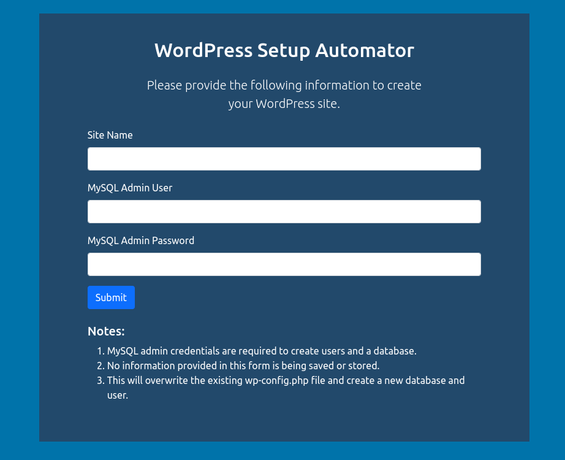
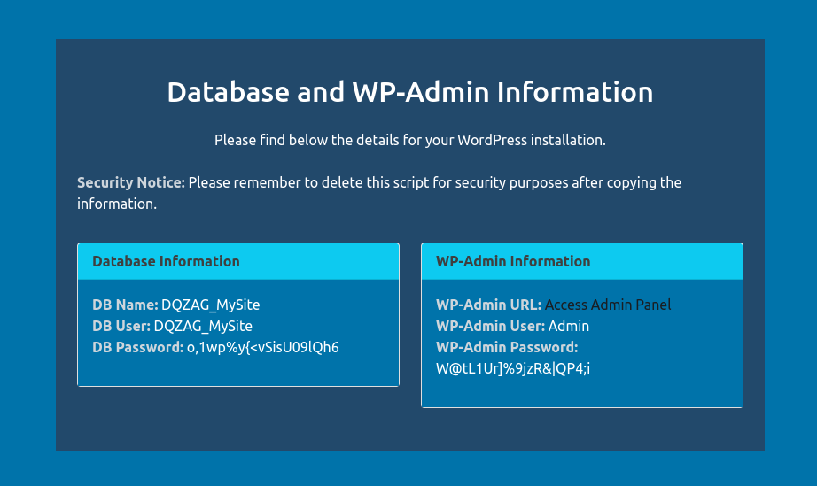

  

# WordPress Setup Automator

## Overview

The WordPress Setup Automator is a powerful PHP script designed to streamline the WordPress installation process. It guides users through database configuration and automates the creation of a new WordPress instance.

## Features

- Effortlessly sets up a new WordPress installation.
- Automates database creation and user management.
- Provides clear instructions and notifications.

## How to Use

1. Download the `wordpress_setup.php` file from this repository.
2. Place the `wordpress_setup.php` file in the directory where you want to install WordPress.
3. Execute the `wordpress_setup.php` file by visiting `http://yourwebsite.com/path_to_wordpress/wordpress_setup.php`.
4. Follow the on-screen instructions to complete the setup process.

## Important Notes

- MySQL admin credentials are required to create users and a database.
- None of the information provided in this form is saved or stored.
- This process will overwrite the existing `wp-config.php` file, creating a new database and user.

## Security Notice

Please remember to delete this script for security purposes after copying the information.

## PHP Requirements

This project requires PHP `7.0` or higher to run successfully. It has been tested on PHP versions `7.0`, `7.1`, `7.2`, `7.3`, `7.4`, `8.0`, and `8.1`. Make sure you have PHP installed on your server with the required extensions enabled.

## Current WordPress Version

The latest version of WordPress as of now is **WordPress 6.3.2**.

## Contributors

- [StunsIO](https://github.com/StunsIO)

## License

This project is licensed under the GNU GENERAL PUBLIC LICENSE License - see the [LICENSE](LICENSE) file for details.
